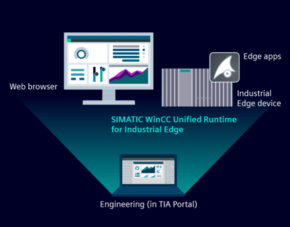

# WinCC Unified for Industrial Edge application example

This example shows how to use the Industrial Edge App "WinCC Unified Runtime".

- [WinCC Unified for Industrial Edge application example](#wincc-unified-for-industrial-edge-application-example)
  - [Description](#description)
    - [Overview](#overview)
    - [General Task](#general-task)
  - [Requirements](#requirements)
    - [Prerequisites](#prerequisites)
    - [Used components](#used-components)
  - [Documentation](#documentation)
  - [Contribution](#contribution)
  - [License and Legal Information](#license-and-legal-information)

## Description
### Overview
This example shows how to use the Industrial Edge App "WinCC Unified Runtime for Industrial Edge" and how to engineer the application in TIA Portal. The application is used to run a WinCC Unified application which comprises a modern UI, integrated alarming system and logging system and much more... You will need "WinCC Unified Runtime" Edge app and TIA Portal for the Engineering.

### General Task
This example shows how to install and configure the "WinCC Unified Runtime" application and how to use the basic functionalities offered by the app. See the [documentation](#documentation) part for more information.

## Requirements

### Prerequisites

-	Access to an Industrial Edge Management System (IEM)
-	Onboarded Industrial Edge Device on IEM
-	Edge device is connected to PLC
-	TIA Portal project loaded on PLC
-	HTML-5 capable Internet browser

### Used components

- Industrial Edge Management (IEM) V1.4.0-42
  - WinCC Unified Runtime V3.0.0-101
-	Industrial Edge Device 1.5.0-21
-	Tia Portal V19 Update 1 or higher
- Hardware Support Package
-	S7-PLCSIM Advanced V4.0

## Documentation

You can find information about the installation and tutorial in the following link:

[Installation and Tutorial](docs/installation_and_tutorial.md)

You can find further documentation and help in the following links:

* [Industrial Edge Hub](https://iehub.eu1.edge.siemens.cloud/#/documentation)
* [Industrial Edge Forum](https://www.siemens.com/industrial-edge-forum)
* [Industrial Edge landing page](https://new.siemens.com/global/en/products/automation/topic-areas/industrial-edge/simatic-edge.html)
* [Industrial Edge GitHub page](https://github.com/industrial-edge)

## Contribution

Thank you for your interest in contributing. Anybody is free to report bugs, unclear documentation, and other problems regarding this repository in the Issues section.
Additionally everybody is free to propose any changes to this repository using Pull Requests.

If you haven't previously signed the [Siemens Contributor License Agreement](https://cla-assistant.io/industrial-edge/) (CLA), the system will automatically prompt you to do so when you submit your Pull Request. This can be conveniently done through the CLA Assistant's online platform. Once the CLA is signed, your Pull Request will automatically be cleared and made ready for merging if all other test stages succeed.

## License and Legal Information

Please read the [Legal information](LICENSE.txt).
