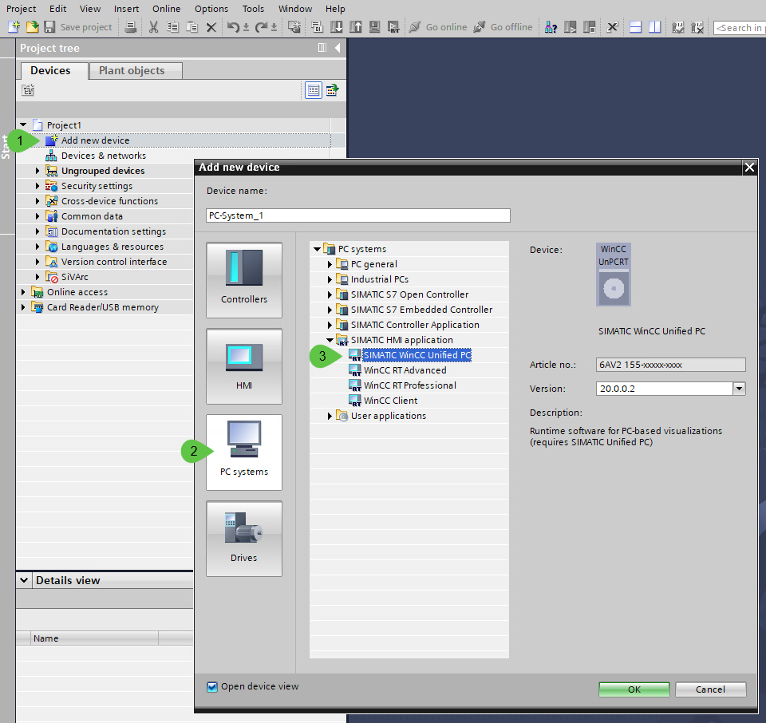
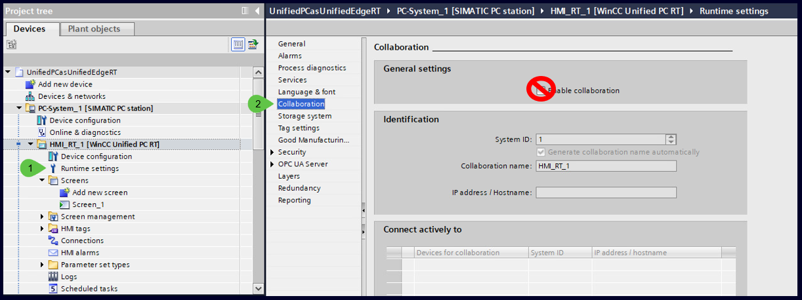
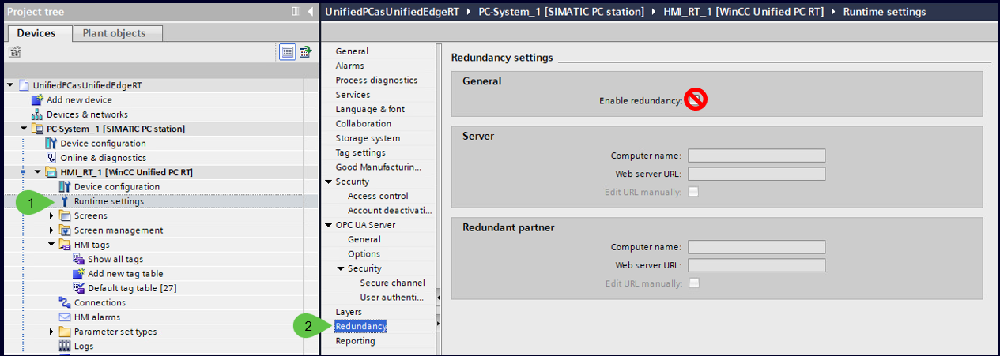

## Creating a device

Clicking on a created project will lead you to the following screen. On the left bar there will be available a tree with all the devices created. Click on the **Add new device** button to create a new one.

Use WinCC Unified PC Runtime version V20 Upd2 or lower from the hardware catalog

### Post-configuration checks

After adding the WinCC Unified PC Runtime device, verify and adjust the following settings to avoid using features that are not supported yet on Industrial Edge:

- **Runtime Collaboration**  
  Do *not* activate Runtime Collaboration.

  

- **Database Type**  
  Set to **SQLite** (Microsoft SQL is not supported).   
  
  

- **GMP / Audit Option**  
  Disable the Audit feature (WinCC Unified “Audit” is not supported). 

  

- **Redundancy**  
  Do *not* enable Redundancy (unsupported).

  

- **Reporting**  
  Do *not* enable Reporting (unsupported).

  