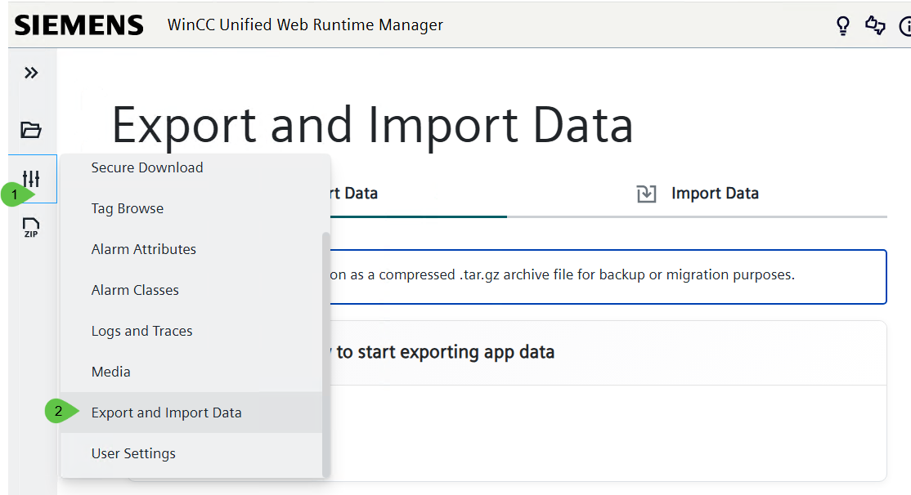
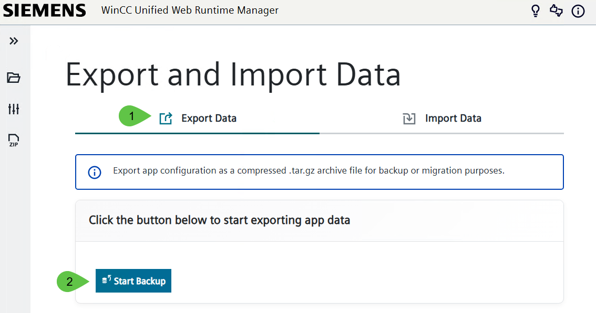
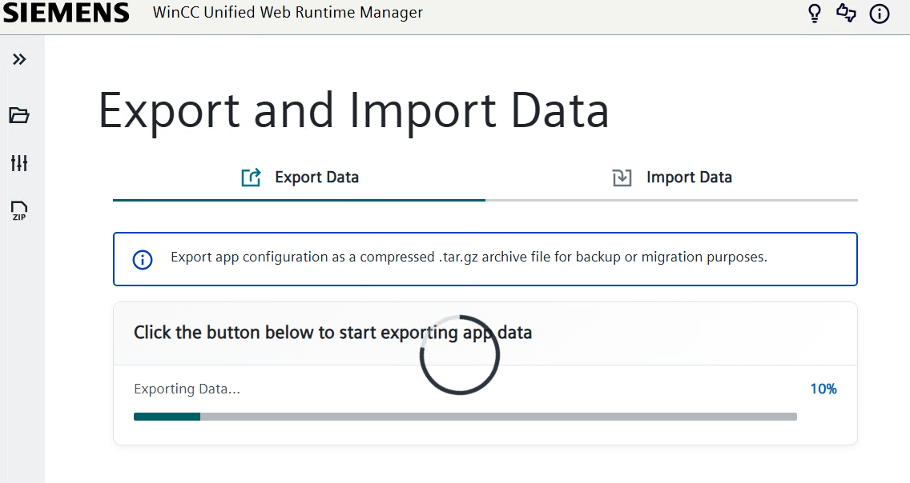
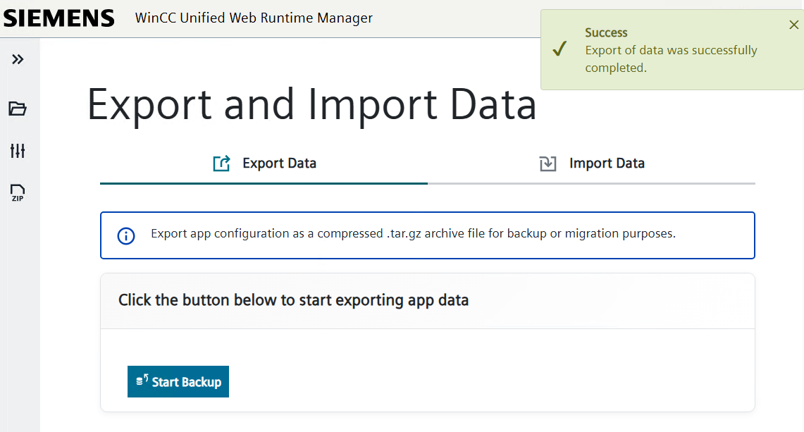
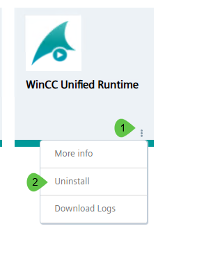
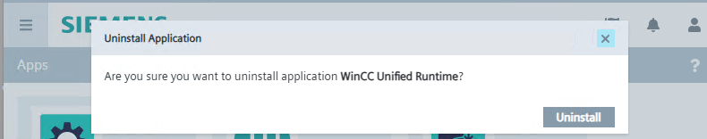
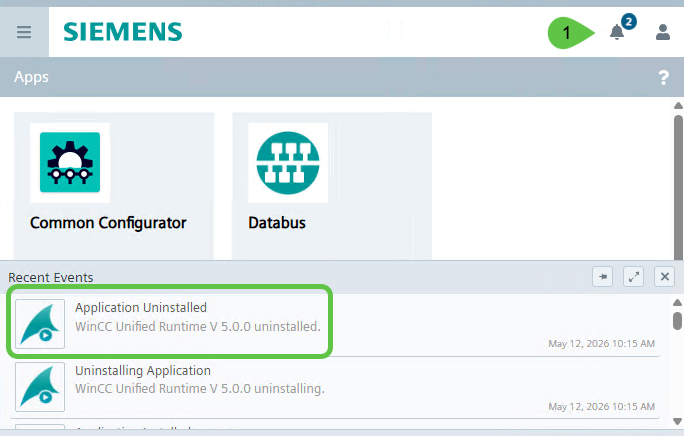
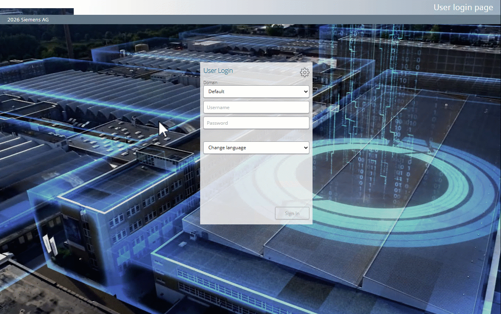
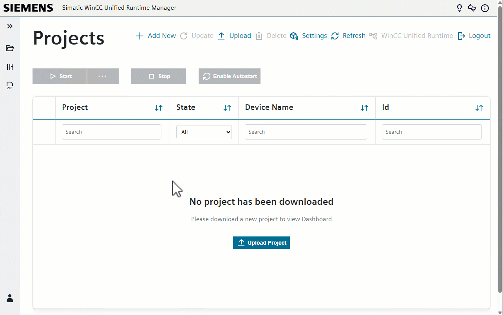
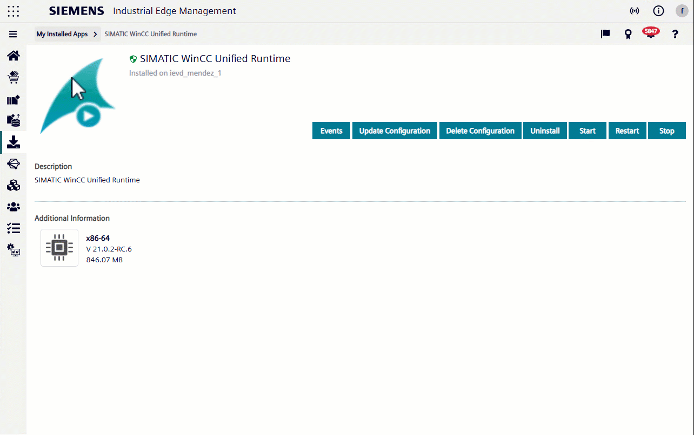

# Migration workflow from V5.0.0 to V21 Upd 2

This document describes the recommended workflow to migrate an existing **WinCC Unified Runtime for Industrial Edge** installation from app version **V5.0.0** to **V21 Upd 2**.

The migration consists of exporting the existing runtime data, replacing the app version on the Industrial Edge Device, importing the backup into the new app version and completing the migration with a download from TIA Portal.

The backup and import steps are performed in the **SIMATIC WinCC Unified Runtime Manager**. The uninstall and installation steps are performed from the Industrial Edge Device or the corresponding Industrial Edge app management workflow. The final project download is performed from **TIA Portal V21 Update 2**.

The basic workflow is:

1. Create a backup in the existing V5.0.0 app and store the backup file safely.
2. Uninstall the existing V5.0.0 app.
3. Install the new V21 Upd 2 app.
4. Import the backup into the new V21 Upd 2 app.
5. Download the required user configuration from TIA Portal.
6. Log in and validate the restored runtime project.

> **Important:**
> Do not uninstall the existing V5.0.0 app before the backup has been successfully created, downloaded and stored in a safe location.

> **Important:**
> User management has been updated in V21 Upd 2. After importing the backup, an additional download from TIA Portal is required to transfer the required user configuration to the new app version. Perform this step before considering the migration complete.

## Prerequisites

Before starting the migration, verify the following points:

* The existing **WinCC Unified Runtime for Industrial Edge V5.0.0** app is running on the Industrial Edge Device.
* You have access to the Industrial Edge Device and to the corresponding Industrial Edge app management workflow.
* **TIA Portal V21 Update 2** is installed.
* A TIA Portal project containing the required user configuration is available.
* A safe storage location is available for the backup archive file.

## Migration procedure

### Step 1: Create and store a backup in the V5.0.0 app

Open the existing **WinCC Unified Runtime for Industrial Edge V5.0.0** app on the Industrial Edge Device.

In the **WinCC Unified Web Runtime Manager**, open the configuration settings from the left-side navigation bar. In the configuration menu, scroll down until **Export and Import Data** is visible and select it.



In the **Export and Import Data** view, make sure that the **Export Data** tab is selected. This tab allows you to export the current app configuration as a compressed **.tar.gz** archive file for backup or migration purposes.

Click **Start Backup** to create the backup.



After clicking **Start Backup**, the export process starts. Wait until the process has finished.



When the export has been completed successfully, a success message is displayed.



Before proceeding, verify that the backup archive file is available and stored in a safe location.

### Step 2: Uninstall the existing V5.0.0 app

Once the backup file has been checked, go to the **Apps** screen of the Industrial Edge Device and locate the existing **WinCC Unified Runtime** app.

Open the app options menu and select **Uninstall**.



A confirmation dialog is displayed. Confirm the action by clicking **Uninstall**.



The uninstall process starts. Wait until the process has finished.

When the app has been uninstalled successfully, an **Application Uninstalled** event is displayed in the **Recent Events** area of the Industrial Edge Device.



The V5.0.0 app has now been removed and the V21 Upd 2 app can be installed.

### Step 3: Install the V21 Upd 2 app

After the existing V5.0.0 app has been uninstalled, install the new **WinCC Unified Runtime for Industrial Edge V21 Upd 2** app on the Industrial Edge Device.

Wait until the installation process has finished.

The installation progress can be checked in the task or event area of the Industrial Edge Device.

When the app has been installed successfully, the new **SIMATIC WinCC Unified Runtime** app is displayed in the **Apps** screen of the Industrial Edge Device.

Open the installed app to access the **SIMATIC WinCC Unified Runtime Manager**.

At the first login, use the default credentials:

```text
User: uoeuser
Password: User@uoe
```

After the first login, the system requests a password change.

Change the default password and store the new credentials in a safe location.

> **Important:**
> The default password must only be used for the initial login. After changing the password, use the new credentials to access the SIMATIC WinCC Unified Runtime Manager.

After the password has been changed successfully, the **SIMATIC WinCC Unified Runtime Manager** can be accessed.



The V21 Upd 2 app has now been installed and prepared. The previously created backup can now be imported.

### Step 4: Import the backup into the V21 Upd 2 app

After the **SIMATIC WinCC Unified Runtime Manager** can be accessed, import the backup that was created in the previous V5.0.0 app.

In the **SIMATIC WinCC Unified Runtime Manager**, open the configuration settings from the left-side navigation bar. In the configuration menu, scroll down until **Export and Import Data** is visible and select it.

In the **Export and Import Data** view, select the **Import Data** tab.

Select the backup archive file that was created in the V5.0.0 app.

The backup file must be the compressed **.tar.gz** archive that was exported during Step 1.

Start the import process.



Wait until the import process has finished. During this process, the backup data is restored into the new V21 Upd 2 app.

When the import has been completed successfully, a success message is displayed.

After the import, the app may restart to apply the restored data. Wait until the **SIMATIC WinCC Unified Runtime Manager** is available again.

Then verify that the runtime projects restored from the backup are displayed in the **SIMATIC WinCC Unified Runtime Manager**.



The imported backup restores the runtime data, such as projects and media files. The required user configuration is completed in the next step by downloading it from TIA Portal.


### Step 5: Download the user configuration from TIA Portal and validate the migration

After the backup has been imported successfully, complete the migration by downloading the required user configuration from TIA Portal.

This step is required because user management has been updated in V21 Upd 2. The download from TIA Portal transfers the required user configuration to the new app version and overwrites the users after the backup import.

It is recommended to use the TIA Portal project that was previously used with V5.0.0. Open the project in **TIA Portal V21 Update 2**, accept the project upgrade when prompted and save the upgraded project.

If the original project is not available, a separate or temporary TIA Portal project can be used for this step, provided that it contains the required users and user settings for the target Industrial Edge Device.

Before downloading, verify that the required users exist in the TIA Portal project.

Start the download to the **WinCC Unified Runtime for Industrial Edge** device.

In the **Load preview** dialog, make sure that the option **keep the current user administration data in runtime** is not selected.

This ensures that the user management configuration from the TIA Portal project replaces the existing user data in the runtime.

Wait until the download process has finished successfully.

After the project has been downloaded, log in with the configured user credentials.

The login domain may change depending on the user management type configured in the TIA Portal project.

After logging in, open the **SIMATIC WinCC Unified Runtime Manager** again and check that all expected runtime projects are available.

Select the runtime project that should be started and start the runtime.

Wait until the project has been started successfully.

Verify that the runtime project reaches the expected running state.

If several runtime projects were restored, repeat this check for each relevant project.

If log data was available before the migration, verify that the expected logs are still available after the migration.

Open the corresponding log view and check that the migrated log entries are displayed.

The migration has been completed successfully when the following points have been verified:

* The backup has been imported successfully.
* The required user configuration has been downloaded from TIA Portal.
* The option **keep the current user administration data in runtime** was not selected during the download.
* Login with the configured user credentials is possible.
* All expected runtime projects are available in the **SIMATIC WinCC Unified Runtime Manager**.
* The restored runtime project can be started successfully.
* The runtime project reaches the expected running state.
* Existing log data is available after the migration, if applicable.
