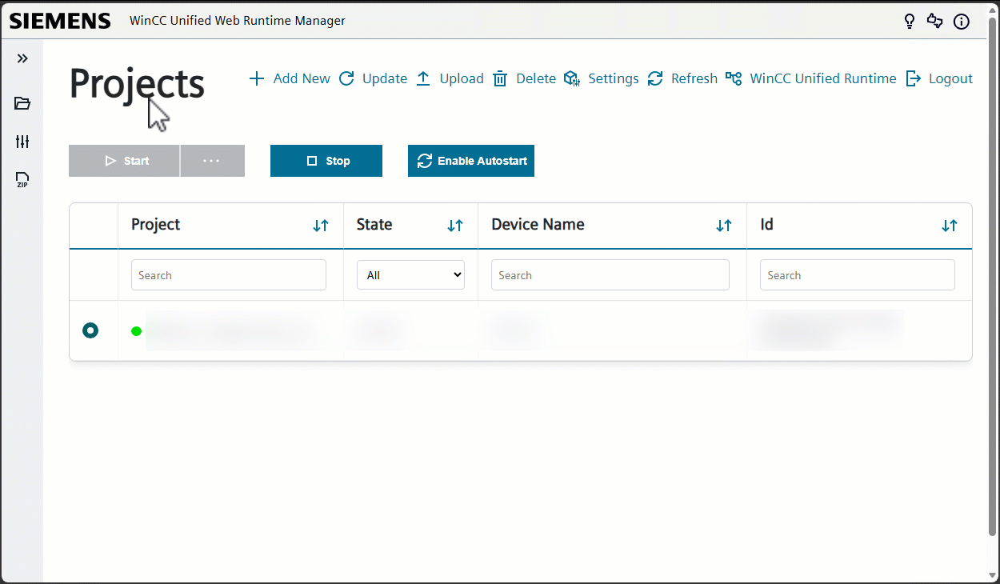
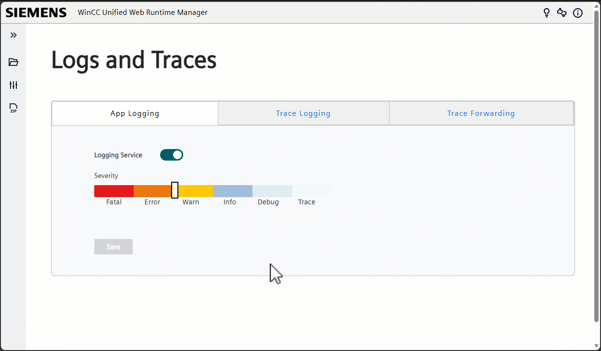
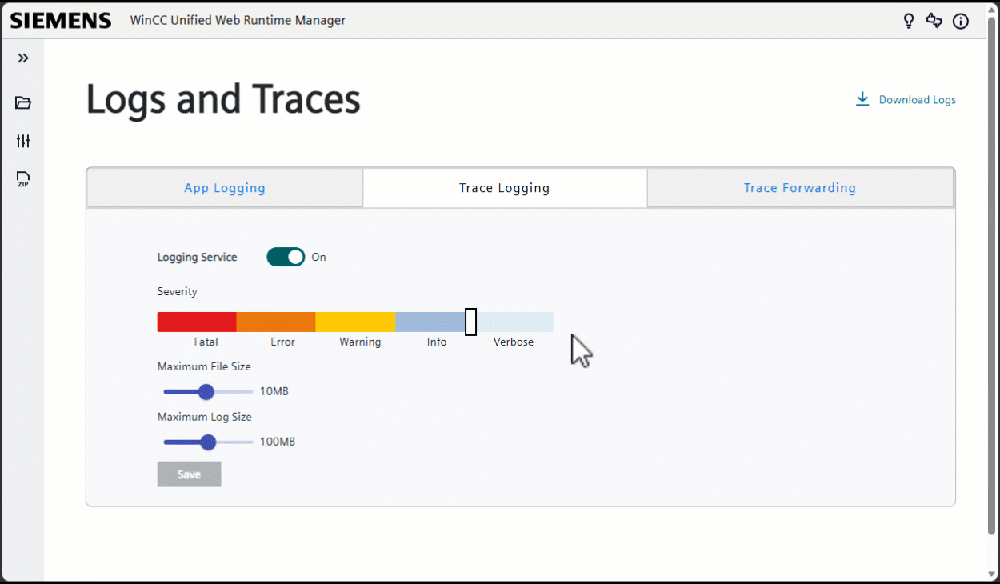
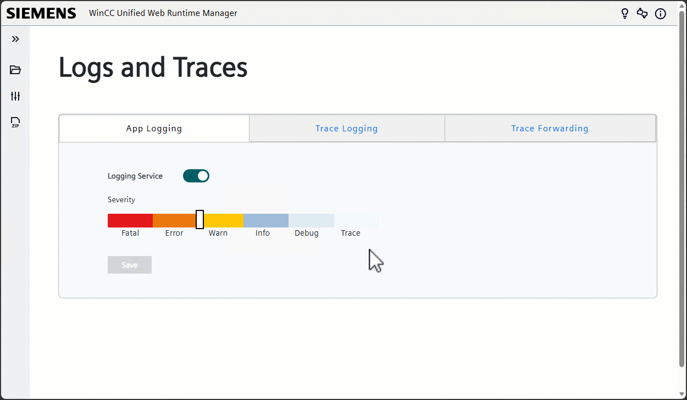

# Trace Settings

This document describes how to collect diagnostic information from the **WinCC Unified Runtime for Industrial Edge** app.

Logs and traces are recorded from the application activity on the Industrial Edge Device and can be configured from **Configuration > Logs and Traces**.

The **Logs and Traces** settings include the following components:

* **App Logging**: Standard application logging. It records high-level application information.
* **Trace Logging**: Detailed trace recording. Trace data is stored as `.csv` files and can be used for further analysis.
* **Trace Forwarding**: Live trace forwarding to Trace Viewer.

Trace and log data can be collected in two different ways:

1. Export logs and trace files directly from the WinCC Unified Web Runtime Manager.
2. Forward live traces to Trace Viewer and export them from there.

> **Important:**
> The WinCC Unified application must be running on the Industrial Edge Device. Docker logs are not generated when there are no active applications.

> **Important:**
> Enable the required logging or trace settings before reproducing the behavior or issue that should be analyzed.

## Procedure 1: Export logs and traces from the WinCC Unified Web Runtime Manager

This procedure can be used to export log and trace files directly from the WinCC Unified Web Runtime Manager.

### Step 1: Open the Logs and Traces settings

Open the **WinCC Unified Runtime** app on the Industrial Edge Device.

In the **WinCC Unified Web Runtime Manager**, open the configuration settings from the left-side navigation bar. In the configuration menu, select **Logs and Traces**.



### Step 2: Configure App Logging

In the **Logs and Traces** view, select the **App Logging** tab.

The **Logging Service** is enabled and locked by default.

Configure the severity level according to the diagnostic information required.

The available severity levels are:

* Fatal
* Error
* Warn
* Info
* Debug
* Trace

The default severity level is **Error**.

Click **Save** to apply the settings.

### Step 3: Configure Trace Logging

In the **Logs and Traces** view, select the **Trace Logging** tab.

Enable Trace Logging if detailed trace files are required.



Trace Logging creates `.csv` trace files in the **TraceLogs** folder. These files can be downloaded and analyzed later.

Configure the severity level according to the diagnostic information required.

The available severity levels are:

* Fatal
* Error
* Warn
* Info
* Verbose

Configure the storage settings if required:

* **Maximum File Size** defines the storage limit for the **TraceLogs** folder on the Industrial Edge Device. The default value is **10 MB** and the maximum value is **20 MB**. When the limit is reached, older `.csv` files are deleted according to the First In First Out (FIFO) principle.
* **Maximum Log Size** defines the size limit for each generated `.csv` log file. The default value is **100 MB** and the maximum value is **200 MB**. When the limit is reached, a new `.csv` file is created.

Click **Save** to apply the settings.

### Step 4: Reproduce the behavior or issue

After the required logging and trace settings have been enabled, reproduce the behavior or issue that should be analyzed.

It is recommended to note the approximate timestamp when the issue occurs. This helps to find the relevant entries in the exported log and trace files.

### Step 5: Download the logs and traces

After the issue has been reproduced, click **Download Logs** in the upper-right corner of the **Logs and Traces** page.



The log and trace files are then downloaded. Store the downloaded files in a safe location.

### Step 6: Prepare the diagnostic package

Collect the downloaded log and trace files and add relevant context information.

Recommended information to include:

* WinCC Unified Runtime for Industrial Edge app version
* Industrial Edge Device version
* TIA Portal version used for the project
* Approximate timestamp when the issue occurred
* Short description of the performed steps
* Screenshots or additional diagnostic information, if available

## Procedure 2: Forward live traces to Trace Viewer

This procedure can be used to collect live trace data with Trace Viewer.

Trace Viewer is installed together with WinCC Unified / TIA Portal.

### Step 1: Open the Logs and Traces settings

Open the **WinCC Unified Runtime** app on the Industrial Edge Device.

In the **WinCC Unified Web Runtime Manager**, open the configuration settings from the left-side navigation bar. In the configuration menu, select **Logs and Traces**.


### Step 2: Enable Trace Forwarding

In the **Logs and Traces** view, select the **Trace Forwarding** tab.

Enable **Forward Trace**.

Configure the trace forwarding settings according to the Trace Viewer receiver configuration.

Click **Save** to apply the settings.



After saving the settings, the WinCC Unified Runtime is prepared to forward trace data to Trace Viewer.

### Step 3: Start Trace Viewer in receiver mode

On the engineering or service PC, open the command prompt as administrator.

To do this on Windows, open the Start menu, search for **Command Prompt**, right-click it and select **Run as administrator**.

> **Note:**
> Administrator rights may be required to start the receiver mode and open the required TCP port.

Start Trace Viewer in receiver mode by using the following command:

```cmd
"C:\Program Files\Siemens\Automation\WinCCUnified\bin\RTILtraceTool.exe" -mode receiver -tcp -host <IED_IP_address> -port 35000
```

Replace `<IED_IP_address>` with the IP address of the Industrial Edge Device.

If the Trace Viewer executable is installed in a different directory, adapt the path accordingly.

Keep the command prompt open while collecting traces.

### Step 4: Open the forwarded traces in Trace Viewer

After the connection with a peer has been established, open **RTILtraceViewer.exe** to view the forwarded traces.

Check that traces are displayed in Trace Viewer.

If no traces are received, verify the following points:

* Trace Viewer receiver mode is running.
* The configured Industrial Edge Device IP address is correct.
* The configured port is correct.
* The Industrial Edge Device and the engineering or service PC can reach each other in the network.
* **Forward Trace** is enabled in the WinCC Unified Web Runtime Manager.
* The WinCC Unified application is running on the Industrial Edge Device.

### Step 5: Reproduce the behavior or issue

After trace forwarding has been enabled and traces are received in Trace Viewer, reproduce the behavior or issue that should be analyzed.

It is recommended to note the approximate timestamp when the issue occurs. This helps to find the relevant entries in the collected trace data.

### Step 6: Export the trace data from Trace Viewer

After the relevant behavior or issue has been reproduced, save or export the received traces from Trace Viewer.

Store the exported trace data in a safe location.

### Step 7: Prepare the diagnostic package

Collect the exported trace data and add relevant context information.

Recommended information to include:

* WinCC Unified Runtime for Industrial Edge app version
* Industrial Edge Device version
* TIA Portal version used for the project
* Approximate timestamp when the issue occurred
* Short description of the performed steps
* Screenshots or additional diagnostic information, if available

## Notes and recommendations

* Enable logging, trace logging or trace forwarding before reproducing the issue.
* Make sure that the WinCC Unified application is running on the Industrial Edge Device.
* Include the approximate timestamp of the issue when collecting log or trace files.
* Stop or disable trace forwarding after the diagnostic data has been collected, if it is no longer required.
* If the exported files are large, compress them before sharing or archiving them.
